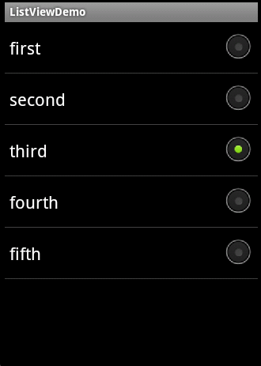

# 03 listview和adatper

我们经常会在应用程序中使用列表的形式来展现一些内容，所以学好ListView是非常必需的。ListView也是Android中比较难以使用的控件，这节内容就将详细解读ListView的用法。

一个ListView通常有两个职责。

+ 将数据填充到布局。
+ 处理用户的选择点击等操作。

第一点很好理解，ListView就是实现这个功能的。第二点也不难做到，在后面的学习中读者会发现，这非常简单。

一个ListView的创建需要3个元素。

+ ListView中的每一列的View。
+ 填入View的数据或者图片等。
+ 连接数据与ListView的适配器。

也就是说，要使用ListView，首先要了解什么是适配器。适配器是一个连接数据和AdapterView（ListView就是一个典型的AdapterView，后面还会学习其他的）的桥梁，通过它能有效地实现数据与AdapterView的分离设置，使AdapterView与数据的绑定更加简便，修改更加方便。

Android中提供了很多的Adapter，下表列出了常用的几个。

 常用适配器

|   Adapter|   含义 |
|:-----------|:-----------|
|  ArrayAdapter<T>         |  用来绑定一个数组，支持泛型操作         |
| SimpleAdapter      |  用来绑定在xml中定义的控件对应的数据        |
|  SimpleCursorAdapter        |  用来绑定游标得到的数据         |
|  BaseAdapter        |  通用的基础适配器        |

 其实适配器还有很多，要注意的是，各种Adapter只不过是转换的方式和能力不一样而已。下面就通过使用不同的Adapter来为ListView绑定数据（SimpleCursorAdapter暂且不讲，SQLite时会介绍）。

##1. ListView使用ArrayAdapter

用ArrayAdapter可以实现简单的ListView的数据绑定。默认情况下，ArrayAdapter绑定每个对象的toString值到layout中预先定义的TextView控件上。ArrayAdapter的使用非常简单。

在布局文件中加入一个ListView控件。
```
<?xmlversion="1.0"encoding="utf-8"?>
<LinearLayoutxmlns:android="http://schemas.android.com/apk/res/android"
    android:layout_width="fill_parent"
    android:layout_height="fill_parent"
    >
<!-- 添加一个ListView控件 -->
<ListView
    android:id="@+id/lv"
    android:layout_width="fill_parent"
    android:layout_height="fill_parent"
    />            
</LinearLayout>
```
然后在Activity中初始化。
```
publicclass MyListView extends Activity {
    
privatestaticfinal String[] strs = new String[] {
    "first", "second", "third", "fourth", "fifth"
    };//定义一个String数组用来显示ListView的内容
private ListView lv;

/** Called when the activity is first created. */
@Override
publicvoid onCreate(Bundle savedInstanceState) {
super.onCreate(savedInstanceState);
        setContentView(R.layout.main);

lv = (ListView) findViewById(R.id.lv);//得到ListView对象的引用
/*为ListView设置Adapter来绑定数据*/
lv.setAdapter(new ArrayAdapter<String>(this,
                android.R.layout.simple_list_item_1, strs));

    }
}
```

效果：


分析一下使用的步骤。

（1）定义一个数组来存放ListView中item的内容。

（2）通过实现ArrayAdapter的构造函数来创建一个ArrayAdapter的对象。

（3）通过ListView的setAdapter()方法绑定ArrayAdapter。

其中第二步有必要说一下的是，ArrayAdapter有多个构造函数，例子中实现的是最常用的一种。第一个参数为上下文，第二个参数为一个包含TextView，用来填充ListView的每一行的布局资源ID。第三个参数为ListView的内容。其中第二个参数可以自定义一个layout，但是这个layout必须要有TextView控件。通常我们使用Android提供的资源，除了例子中所用的，常用的还有如下几种，可实现带RadioButton和CheckBox的ListView。

（1）通过指定android.R.layout.simple_list_item_checked这个资源，实现带选择框的ListView。需要用setChoiceMode()方法设定选择为多选还是单选，否则将不能实现选择效果，运行效果如图4-30所示。

实现代码如下：
```
lv.setAdapter(new ArrayAdapter<String>(this,
                android.R.layout.simple_list_item_checked, strs));
lv.setChoiceMode(ListView.CHOICE_MODE_MULTIPLE);
```

（2）通过指定android.R.layout.simple_list_item_multiple_choice这个资源实现带CheckBox的ListView。同样的，需要用setChoiceMode()方法来设置单选或者多选，运行效果如图4-31所示。

实现代码如下：
```
lv.setAdapter(new ArrayAdapter<String>(this,
                android.R.layout.simple_list_item_multiple_choice, strs));
lv.setChoiceMode(ListView.CHOICE_MODE_MULTIPLE);
```

（3）通过指定android.R.layout.simple_list_item_single_choice这个资源实现带RadioButton的ListView。这里要注意的是，这里并不是指定了单选。是多选还是单选要通过setChoiceMode()方法来指定，运行效果如图4-32所示。

实现代码如下：

```
lv.setAdapter(newArrayAdapter<String>(this,android.R.layout.simple_list_item_single_choice,strs));
lv.setChoiceMode(ListView.CHOICE_MODE_SINGLE);
```

效果：

+ 带选择框的ListView 


+ 带CheckBox的ListView   


+ 带RadioButton的ListView


在前面讲到过，ListView的职责除了填充数据外，还要处理用户的操作。通过如下的代码就可以为ListView绑定一个点击监听器，点击后在标题栏显示点击的行数。
```
lv.setOnItemClickListener(new OnItemClickListener() {

            @Override
            publicvoid onItemClick(AdapterView<?> arg0, View arg1, int arg2,
                    long arg3) {
                    //点击后在标题上显示点击了第几行
                    setTitle("你点击了第"+arg2+"行");
            }
        });
```

##2. ListView使用SimpleAdapter

很多时候需要在列表中展示一些除了文字以外的东西，比如图片等。这时候可以使用SimpleAdapter。SimpleAdapter的使用也非常简单，同时它的功能也非常强大。可以通过它自定义ListView中的item的内容，比如图片、多选框等。看一个例子，实现一个每一行都有一个ImageView和TextView的ListView。先看一下运行效果，如图所示。


首先在布局文件中增加一个ListView控件。

还需要定义一个ListView中每一行的布局，用RelativeLayout来实现一个带两行字和一个图片的布局。

item.xml:
```
<?xmlversion="1.0"encoding="utf-8"?>
<RelativeLayout
xmlns:android="http://schemas.android.com/apk/res/android"
android:layout_height="fill_parent"
android:layout_width="fill_parent">
<ImageView
android:layout_alignParentRight="true"
android:layout_width="wrap_content"
android:layout_height="wrap_content"
android:id="@+id/ItemImage"
/>
<TextView
android:id="@+id/ItemTitle"
android:layout_height="wrap_content"
android:layout_width="fill_parent"
android:textSize="20sp"
/>
<TextView
android:id="@+id/ItemText"
android:layout_height="wrap_content"
android:layout_width="fill_parent"
android:layout_below="@+id/ItemTitle"
/>
</RelativeLayout>
```

配置完毕，就可以在Java代码中为ListView绑定数据。

```
publicclass MyListViewSimple extends Activity {
    
    private ListView lv;
    
/** Called when the activity is first created. */
@Override
publicvoid onCreate(Bundle savedInstanceState) {
super.onCreate(savedInstanceState);
        setContentView(R.layout.main);

lv = (ListView) findViewById(R.id.lv);
/*定义一个动态数组*/
          ArrayList<HashMap<String, Object>> listItem = new ArrayList<HashMap<String,     Object>>();
/*在数组中存放数据*/
for(int i=0;i<10;i++)  
        {  
            HashMap<String, Object> map = new HashMap<String, Object>();  
            map.put("ItemImage", R.drawable.icon);//加入图片
            map.put("ItemTitle", "第"+i+"行");  
            map.put("ItemText", "这是第"+i+"行");  
            listItem.add(map);  
        } 

        SimpleAdapter mSimpleAdapter = new SimpleAdapter(this,listItem,//需要绑定的数据
                R.layout.item,//每一行的布局
//动态数组中的数据源的键对应到定义布局的View中
new String[] {"ItemImage","ItemTitle", "ItemText"},   
newint[] {R.id.ItemImage,R.id.ItemTitle,R.id.ItemText}  
            );

lv.setAdapter(mSimpleAdapter);//为ListView绑定适配器

lv.setOnItemClickListener(new OnItemClickListener() {

            @Override
            publicvoid onItemClick(AdapterView<?> arg0, View arg1, int arg2,
                    long arg3) {
                setTitle("你点击了第"+arg2+"行");//设置标题栏显示点击的行
                
            }
        });
    }
}
```

使用simpleAdapter的数据一般都是用HashMap构成的列表，列表的每一节对应ListView的每一行。通过SimpleAdapter的构造函数，将HashMap的每个键的数据映射到布局文件中对应控件上。这个布局文件一般根据自己的需要来自己定义。梳理一下使用SimpleAdapter的步骤。

（1）根据需要定义ListView每行所实现的布局。
（2）定义一个HashMap构成的列表，将数据以键值对的方式存放在里面。
（3）构造SimpleAdapter对象。
（4）将LsitView绑定到SimpleAdapter上。

##3. ListView使用BaseAdapter与ListView的优化

在ListView的使用中，有时候还需要在里面加入按钮等控件，实现单独的操作。也就是说，这个ListView不再只是展示数据，也不仅仅是这一行要来处理用户的操作，而是里面的控件要获得用户的焦点。读者可以试试用SimpleAdapter添加一个按钮到ListView的条目中，会发现可以添加，但是却无法获得焦点，点击操作被ListView的Item所覆盖。这时候最方便的方法就是使用灵活的适配器BaseAdapter了。

 