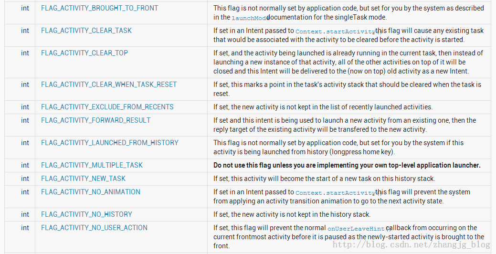

# 04 android 标准intent使用

##1. Android系统用于Activity的标准Intent

1. 根据联系人ID显示联系人信息
```
        Intent intent = new Intent();
        intent.setAction(Intent.ACTION_VIEW);   //显示联系人信息
        intent.setData(Uri.parse("content://contacts/people/492"));
        startActivity(intent);
```

2. 根据联系人ID显示拨号面板
```
        Intent intent = new Intent();
        intent.setAction(Intent.ACTION_DIAL);  //显示拨号面板
        intent.setData(Uri.parse("content://contacts/people/492"));
        startActivity(intent);
```

3. 显示拨号面板， 并在拨号面板上将号码显示出来
```
        Intent intent = new Intent();
        intent.setAction(Intent.ACTION_VIEW);   
        intent.setData(Uri.parse("tel://15216448315"));
        startActivity(intent);
```

4. 显示拨号面板， 并在拨号面板上将号码显示出来
```
        Intent intent = new Intent();
        intent.setAction(Intent.ACTION_DIAL);   //显示拨号面板, 并在拨号面板上将号码显示出来
        intent.setData(Uri.parse("tel://15216448315"));
        startActivity(intent);
```

5. 根据联系人的ID编辑联系人
```
        Intent intent = new Intent();
        intent.setAction(Intent.ACTION_EDIT);   //编辑联系人
        intent.setData(Uri.parse("content://contacts/people/492"));
        startActivity(intent);
```

6. 显示通讯录联系人和其他账号联系人的列表
```
        Intent intent = new Intent();
        intent.setAction(Intent.ACTION_VIEW);   
        intent.setData(Uri.parse("content://contacts/people/"));
        startActivity(intent);
```

7. 启动HomeScreen
```
        Intent intent = new Intent();
        intent.setAction(Intent.ACTION_MAIN);     //启动HomeScreen
        intent.addCategory(Intent.CATEGORY_HOME);
        startActivity(intent);
```

8. 选择某个联系人的号码，返回一个代表这个号码的uri，如:content://contacts/phones/982
```
        Intent intent = new Intent();
        intent.setAction(Intent.ACTION_GET_CONTENT);     
        intent.setType("vnd.android.cursor.item/phone");
        startActivityForResult(intent, 1);
```

9. 打开多个应用选取各种类型的数据,以uri返回。返回的uri可使用ContentResolver.openInputStream(Uri)打开
该功能可用在邮件中附件的选取
举例如下:
选取一张图片, 返回的uri为 content://media/external/images/media/47
选取一首歌, 返回的uri为 content://media/external/audio/media/51
```
        Intent intent = new Intent();
        intent.setAction(Intent.ACTION_GET_CONTENT);     
        intent.setType("*/*");
        intent.addCategory(Intent.CATEGORY_OPENABLE);
        startActivityForResult(intent, 2);
```

10. 自定义一个chooser，不使用系统的chooser
     该chooser可以有自己的标题(Title)
     并且不必让用户指定偏好
```
        Intent intent = new Intent();
        intent.setAction(Intent.ACTION_CHOOSER); 
        intent.putExtra(Intent.EXTRA_TITLE, "my chooser");
        intent.putExtra(Intent.EXTRA_INTENT, 
                new Intent(Intent.ACTION_GET_CONTENT)
                .setType("*/*")
                .addCategory(Intent.CATEGORY_OPENABLE)
                );
        
        startActivityForResult(intent, 2);
```

11. 选取activity，返回的activity可在返回的intent.getComponent()中得到
```
        Intent intent = new Intent();
        intent.setAction(Intent.ACTION_PICK_ACTIVITY); 
        intent.putExtra( Intent.EXTRA_INTENT, 
                new Intent(Intent.ACTION_GET_CONTENT)
                .setType("*/*")
                .addCategory(Intent.CATEGORY_OPENABLE)
                );
        startActivityForResult(intent, 3);
```

12. 启动搜索，在以下示例代码中，"ANDROID"为要搜索的字符串
     当执行这段代码后, 会在系统的Chooser中显示可以用于搜索的程序列表
```
        Intent intent = new Intent();
        intent.setAction(Intent.ACTION_SEARCH);     //启动搜索
        intent.putExtra(SearchManager.QUERY, "ANDROID");
        startActivity(intent);
```

13. 启动WEB搜索，在以下示例代码中，"ANDROID"为要搜索的字符串
     当执行这段代码后, 会在系统的Chooser中显示可以用于搜索的程序列表，一般情况下系统中安装的浏览器都会显示出来
```
        Intent intent = new Intent();
        intent.setAction(Intent.ACTION_WEB_SEARCH);     //启动搜索
        intent.putExtra(SearchManager.QUERY, "ANDROID");
        startActivity(intent);
```

##2. Android系统用于BroadcastReceiver的标准Intent

1. ACTION_TIME_TICK，系统时钟广播，系统每分钟都会发送一个这样的广播，
   如果在应用开发中，有些逻辑依赖于系统时钟，可以注册一个广播接收者
   这是一个受保护的action，只有系统才能发送这个广播
   并且，在manifest文件中注册的广播接收者不能接收到该广播，若要接收该广播，必须在代码中注册广播接收者
```
        registerReceiver(new BroadcastReceiver(){

            @Override
            public void onReceive(Context context, Intent intent) {
                Log.i("xxxx", "TIME_TICK");
            }
            
        }, 
        new IntentFilter(Intent.ACTION_TIME_TICK));
```

2. 在官方文档中，列出了以下标准的广播action
```
ACTION_TIME_TICK               系统时钟广播
ACTION_TIME_CHANGED            时间被重新设置
ACTION_TIMEZONE_CHANGED        时区改变
ACTION_BOOT_COMPLETED          系统启动完成
ACTION_PACKAGE_ADDED           系统中安装了新的应用
ACTION_PACKAGE_CHANGED         系统中已存在的app包被更改
ACTION_PACKAGE_REMOVED         系统中已存在的app被移除
ACTION_PACKAGE_RESTARTED       用户重启了一个app，这个app的所有进程被杀死
ACTION_PACKAGE_DATA_CLEARED    用户清除了一个app的数据
ACTION_UID_REMOVED             系统中的一个user ID被移除
ACTION_BATTERY_CHANGED         电池状态改变，这是一个sticky广播
ACTION_POWER_CONNECTED         设备连接了外部电源
ACTION_POWER_DISCONNECTED      外部电源被移除
ACTION_SHUTDOWN                设备正在关机
```

##3.  Android中的标准类别（category）

类别（category）一般配合action使用，以下为系统中的标准类别，由于数量过多，只能在使用到时再详细研究
```
CATEGORY_DEFAULT
CATEGORY_BROWSABLE
CATEGORY_TAB
CATEGORY_ALTERNATIVE
CATEGORY_SELECTED_ALTERNATIVE
CATEGORY_LAUNCHER
CATEGORY_INFO
CATEGORY_HOME
CATEGORY_PREFERENCE
CATEGORY_TEST
CATEGORY_CAR_DOCK
CATEGORY_DESK_DOCK
CATEGORY_LE_DESK_DOCK
CATEGORY_HE_DESK_DOCK
CATEGORY_CAR_MODE
CATEGORY_APP_MARKET
```

##4. Android中的标准Extra键值

这些常量用于在调用Intent.putExtra(String, Bundle)时作为键值传递数据，同样由于数量较多，在此只列出索引
```
EXTRA_ALARM_COUNT
EXTRA_BCC
EXTRA_CC
EXTRA_CHANGED_COMPONENT_NAME
EXTRA_DATA_REMOVED
EXTRA_DOCK_STATE
EXTRA_DOCK_STATE_HE_DESK
EXTRA_DOCK_STATE_LE_DESK
EXTRA_DOCK_STATE_CAR
EXTRA_DOCK_STATE_DESK
EXTRA_DOCK_STATE_UNDOCKED
EXTRA_DONT_KILL_APP
EXTRA_EMAIL
EXTRA_INITIAL_INTENTS
EXTRA_INTENT
EXTRA_KEY_EVENT
EXTRA_ORIGINATING_URI
EXTRA_PHONE_NUMBER
EXTRA_REFERRER
EXTRA_REMOTE_INTENT_TOKEN
EXTRA_REPLACING
EXTRA_SHORTCUT_ICON
EXTRA_SHORTCUT_ICON_RESOURCE
EXTRA_SHORTCUT_INTENT
EXTRA_STREAM
EXTRA_SHORTCUT_NAME
EXTRA_SUBJECT
EXTRA_TEMPLATE
EXTRA_TEXT
EXTRA_TITLE
EXTRA_UID
```

##5.  Intent中的标志（FLAG）

Intent类中定义了一些以FLAG_开头的标志位，这些标志位中有的非常重要，会影响app中Activity和BroadcastReceiver等的行为。
以下为这些标志位的索引，是从官方文档上的截图。之后会对重要的标志加以详细分析

